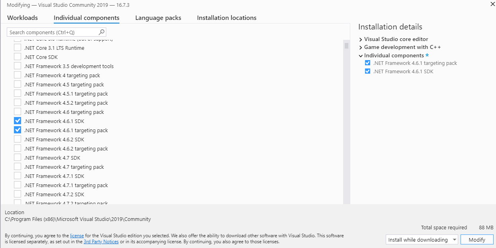

# Live Link to Unreal Sample Project

This project has example code for live streaming pose data from Radical Studio to Unreal Engine (version 4.25). Note: to open this sample project, you must have **Visual Studio** and the **Game Development with C++** module installed. See  for more information. 

You will also additionally need .NET SDK installed to build the project. You can modify your Visual Studio installation as follows:

See the `BP_RADiCAL` and `AnimBP_RADiCAL_3-1` assets for a demonstration of real-time LiveLink retargeting to the RADiCAL skeleton (v3.1).

The can be retargeted in real-time to the Epic skeleton as well, which allows you to use Marketplace characters that are rigged using the Epic skeleton. See the `BP_Epic` and `AnimBP_EpicGames_Mannequin_Skeleton` assets for more details.

The LiveLink retargeting to the Mixamo skeleton is still a work in progress (see `AnimBP_Mixamo`)

Using post-recording Animation Retargeting, recorded Live Link data can also be retargeted to other skeletons with good results.

### Live Link Setup
After starting the Live Link stream from Radical Studio, open the UE4 editor and go to Window -> Live Link. Go to Source -> Message Bus Source -> select the `RadLiveLink` source. There will be a random alphanumeric string appended to the name, to differentiate between multiple Live Link sources on the network (e.g. other instances of Radical Studio). You can now close this window.

### Live Link Preview
The Live Link data can be previewed inside the Skeleton, Skeletal Mesh, Blueprint or Animation Blueprint windows for a given skeletal asset. On the right side, go to Preview Scene Settings, under Animation, change the Preview Controller to Live Link Preview Controller. Then, change the Live Link Subject Name to `RadicalPose`.
For Retarget Asset, select the corresponding blueprint Remap Asset file for that skeleton. For example, for the Radical skeleton, choose the `RadToRadRemap` asset. For the Epic skeleton, choose the `BP_RadToEpicRemap` asset.

### Remap Assets
In order to use skeletons other than the Radical skeleton, we need to remap the Radical skeleton's bone names to their counterparts on other skeletons. For example, if you open the `BP_RadToEpicRemap` asset and go to the `GetRemappedBoneName` function, you can see a big switch statement that performs the remapping. For Mixamo, the skeleton bone names match the RADiCAL skeleton bone names, so this step is unnecessary.

### Rotation conversions
To account for some of the differences between the Radical Studio coordinate frame and Unreal, we have flipped the incoming LiveLink data's rotation and position axes. You can inspect the conversions at the `RadicalLiveLinkRemapAssetBase` class and its child classes. We expect that other skeletons will require different rotation adjustments, including swapping axes. We exposed three overridable methods to implement the root bone position, root bone rotation, and non-root bone rotation conversions. Please note that the AI output in Radical Studio uses the hip bone as a root, so position data should be mapped to the hips (or pelvis) in the target skeleton.

### Real-time Remapping/Retargeting
To remap the LiveLink data (which matches RADiCAL 3.1 skeleton structure) to other skeletons, modifications to the bone rotations may be required. The incoming LiveLink data contains rotation offsets from the RADiCAL's base T-pose, and hip position. For the Epic skeleton, we tweaked the arm rotations in the AnimBP, as the Epic skeleton uses an A pose by default. For the Mixamo skeleton, there are more complex differences, such as an inverted rotation for the the `LeftUpLeg` bone's Y axis (among others).

### Post-recording Remapping/Retargeting
Unreal provides built-in tools for retargeting existing animations (i.e. animations created with Take Recorder, or imported FBX) to other skeletons. Once the animation asset is produced, you can retarget to any other skeleton by setting up the Retarget Manager and ensuring that both the source and target skeletons have a T-Pose. Please see our  for more details.
